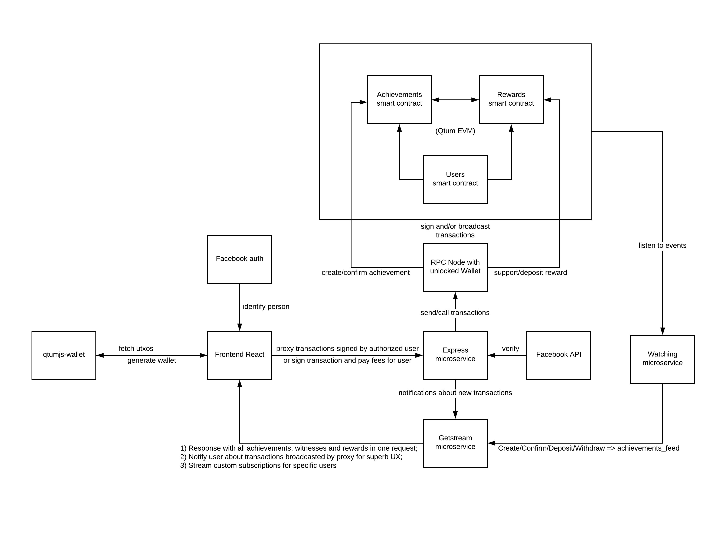

# qtum-dapp-documentation

[Last Update: 16th September 2018]

High-level (non technical) documentation about diadem network project

Table of content:  

- [qtum-dapp-documentation](#qtum-dapp-documentation)
  - [What is Diadem Network?](#what-is-diadem-network)
  - [What is Diadem Network composed of?](#what-is-diadem-network-composed-of)
  - [Roadmap](#roadmap)
  - [Future improvement ideas (waiting for real usage feedbacks)](#future-improvement-ideas-waiting-for-real-usage-feedbacks)

## What is Diadem Network?

Diadem Network leverages blockchain technology from [Qtum](https://qtum.org) and [Facebook](https://www.facebook.com/)  

On Diadem network you can be an achiever and/or a sponsor.

**Achiever**:  
Fighting for the planet? Helping people out? But you need a boost?  
Get financial support using Diadem Network:  

1. Publish a Facebook post explaining your achievement (with text, picture(s), video(s)).  
2. **CREATE YOUR ACHIEVEMENT** on Diadem Network with the link to your Facebook post.  
3. **WITHDRAW** QTUM tokens you receive from others supporting your great actions!  

Note you can **UPDATE YOUR ACHIEVEMENT** if it evolves. Available only if you created one.

**Sponsor**:  
You want to financially support people helping the world?  

- **CONFIRM** achievements you know are real.  
- You want to give immediate **SUPPORT** ? You can send QTUM tokens right away.  
- You prefer waiting for someone you choose to confirm the achievement ? Then **DEPOSIT** QTUM tokens. They will not be transferred until he does.  

Note about application usage:  
- Facebook Login is required to perform most actions.  
- A hot wallet is used to manage QTUM transactions.  
- Creating, Updating and Confirming achievements are free.  
- Supporting, Depositing and Withdrawing require QTUM tokens.  
- [Check official QTUM user guide here](https://docs.qtum.site/en/) to know how to send QTUM tokens to yourself.  
  

**#diademnetwork**

If you need more help, have questions, improvements ideas, or just want to say hello, don't hesitate contacting us at: team@diadem.network  

## What is Diadem Network composed of?

- [Client](https://github.com/DiademNetwork/qtum-dapp-client)
- [Server](https://github.com/DiademNetwork/qtum-dapp-backend)
- [Watchers](https://github.com/DiademNetwork/qtum-dapp-watcher)
- [Contracts](https://github.com/DiademNetwork/qtum-smart-contracts)

## Top level architecture:

## Roadmap

- September 2018: Release of Proof of Concept mainnet version for QTUM Hackathon
- October 2018: Feature freeze to remove technical debt induced by Hackathon, while gathering users feedbacks
- November/December 2018: Preparing next version release for Q1 2019, with features based on feedbacks.
- 2019: TBD

## Future improvement ideas (waiting for real usage feedbacks)

- Internationalize platform, so anyone in the world can participate
- Add other types of achievements (self-goal-achievement, group achievement, one-time/running achievement...) and their custom rules
- Add categories for achievements (art, society, education, ecology...)
- Add filters (by date, by category, by confirmations count....) for achievements on platform.
- Add search function to find achievement(s) (search by title, creator...)
- Make it possible to choose a group of witnesses for deposit, with configurable rules (all must confirm / half must confirm ?)
- Integrate Diadem Network with other social networks (Twitter, Google+, Medium...)
- Improve fee management in hot wallet (so users can chose fees they are willing to spend, to make blockchain confirmations faster)
- Add possibility to report an achievement (for example if someone post something non-ethical)
- Or add administrator users to filter achievements at creation time ? => To be discussed
- Add possibility to delete his achievement(s)
- Make it possible to create more than one achievement per user
- Integrate with Qrypto (or equivalent) if user prefer to use it instead of DM Hot wallet

       

  

